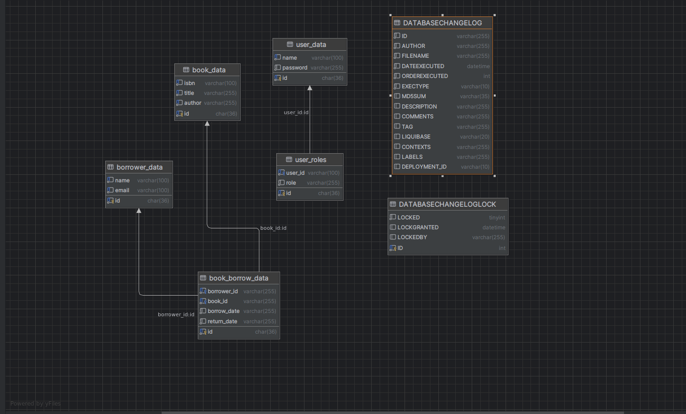

# Booking Manager

This is a small Spring Boot simulation for a library system that incorporates all major technical stacks of Spring Boot, excluding most of Spring Cloud.

## Major Technical Stack

| Technology             | Details                                                                                 |
|------------------------|-----------------------------------------------------------------------------------------|
| **Spring Boot**        | 3.3.2                                                                                   |
| **Database**           | MySQL                                                                                   |
| **Security**           | JWT (JSON Web Token)                                                                    |
| **Spring Modules**     | Spring Data JPA, Spring MVC, Spring Security, Spring Validation                         |
| **Build Tool**         | Maven                                                                                    |
| **Additional Libraries**| MapStruct, Hibernate, Liquibase, Lombok, SpringDoc OpenAPI                              |

## Database Schema


## Installation Instructions

1. Clone the repository:
    ```bash
    git clone https://github.com/MThilina/booking-manager.git
    ```
2. Navigate to the project directory:
    ```bash
    cd booking-manager
    ```
3. Build the project:
    ```bash
    mvn clean install
    ```
4. Run the project:
    ```bash
    mvn spring-boot:run
    ```
5. Run Project with Docker-Compose: (Go to the related folder)
   ```bash
    docker-composer up --build
   ```
## Usage Instructions

The following are the main API endpoints available in the project:

- **Get All Books**: `GET /api/library/books`
- **Register New Book**: `POST /api/library/books`
- **Register Borrower**: `POST /api/library/borrowers`
- **Borrow Book**: `GET /api/library/borrowers/{borrowerId}/books/{bookId}`
- **Return A Borrowed Book**: `PATCH /api/library/borrowers/{borrowerId}/books/{bookId}`
- **Auth Request**: `GET /api/v1/auth/token` (with basic authentication)

### Postman Collection

A Postman collection is available for testing the API endpoints. Import the `Booking-Management.postman_collection.json` file into Postman to get started.
Postman collection can be browsed at document folder 
## Open API Implementation

This Project contains the Open API and it can be accessed with any authentication. it can be accessed by the
Access Url : {{Host}}/swagger-ui/index.html

## Features

- Register and manage books in the library
- Register and manage borrowers
- Borrow and return books
- Secure authentication and authorization using JWT

---


